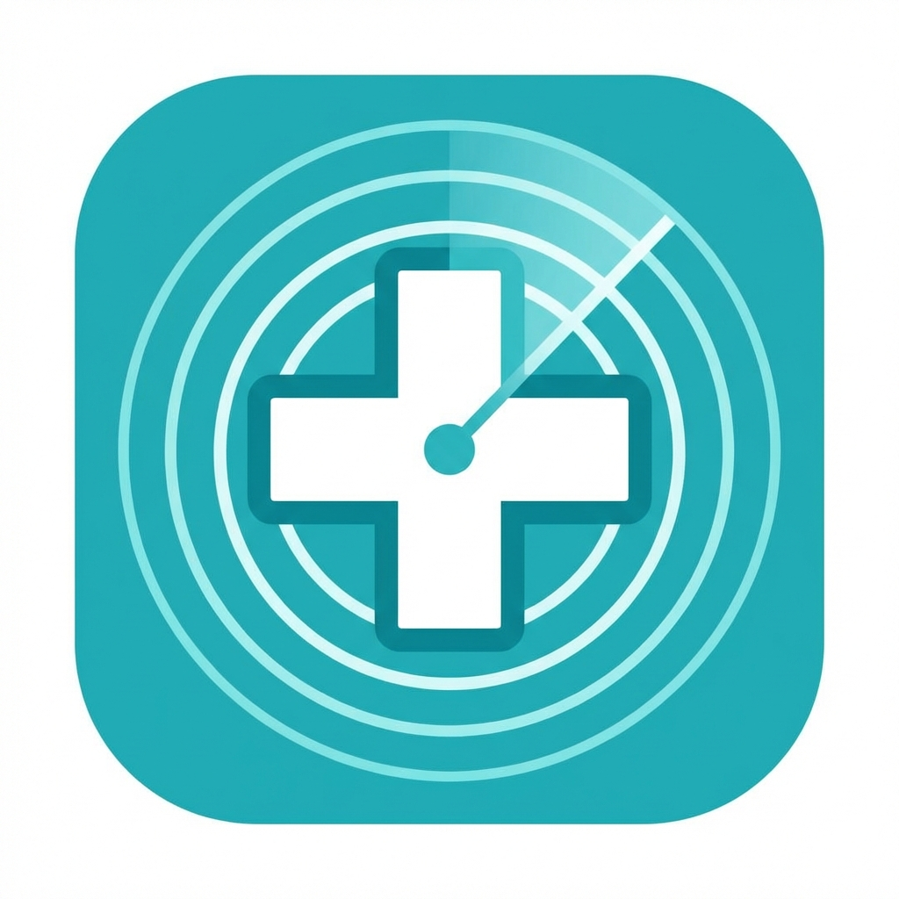

#  MedPulseBot: ESP32 BLE Scanner & Telegram Notification System

## Overview
**MedPulseBot** is a tracking system that uses an ESP32 to scan for Bluetooth Low Energy (BLE) devices (like smartphones, beacons, or wearables). When a target device is detected, it communicates with a **PocketBase** backend to verify the device and sends a real-time notification to a configured **Telegram** account.

## System Architecture
1.  **Scanner Node (ESP32)**: Scans for BLE advertisements and sends data to the backend.
2.  **Backend (Go)**: API server that processes detections, interacts with PocketBase, and handles Telegram alerts.
3.  **Database (PocketBase)**: Stores employee data, device whitelists, and attendance logs.
4.  **Notifications (Telegram)**: Delivers instant alerts when specific devices are detected.

## Project Structure
- `main.go`: The backend API entry point.
- `internal/`: Core logic (Handlers, Services, Repositories).
- `config/`: Configuration and environment variable loading.
- `firmware/scanner/`: Arduino code for the ESP32.
- `migrations/`: PocketBase schema migrations.
- `assets/`: Project assets (icons, etc.).
- `run.sh`: Helper script to run the project with local Go environment isolation.

## Prerequisites
- **Go 1.22+**
- **PocketBase** (Running instance)
- **Arduino IDE** (with ESP32 board support)

## Setup

### 1. Backend Configuration
Copy `.env.example` to `.env` and edit it with your details:

```bash
cp .env.example .env
```

Or manually create a `.env` file:

```env
# PocketBase Configuration
POCKETBASE_URL=http://192.168.100.100:8090
POCKETBASE_TOKEN=your_pocketbase_admin_token

# Telegram Bot Configuration
TELEGRAM_BOT_TOKEN=your_telegram_bot_token
AUTHORIZED_CHAT_ID=your_chat_id
```

### 2. Database Initialization
This project requires specific fields in your PocketBase `employee_detections` collection. Run the migration script to set them up:

```bash
# Ensure .env is set correctly first!
go run scripts/migrate/main.go

# Or using Makefile
make migrate-db-go
```

### 3. Running the Backend
Use the provided script to avoid permission/path issues:

```bash
chmod +x run.sh
./run.sh
```

The server will start on port `8080`.

### 3. ESP32 Firmware
1.  Open `firmware/scanner/scanner.ino` in Arduino IDE.
2.  Install necessary libraries (e.g., `ArduinoJson`, `HTTPClient`).
3.  Configure your network settings in `config.h` (or main file):
    - `SSID`: WiFi Name
    - `PASSWORD`: WiFi Password
    - `BACKEND_URL`: `http://<YOUR_COMPUTER_IP>:8080/api/detect`
4.  Upload to your ESP32 board.

## API Endpoints

### `POST /api/detect`
Receives detection data from the ESP32.

**Payload:**
```json
{
  "mac_address": "AA:BB:CC:DD:EE:FF",
  "rssi": -75,
  "timestamp": 1678900000
}
```

## Troubleshooting
- **Backend Connection**: Ensure your computer's firewall allows incoming connections on port `8080`.
- **Token Errors**: If the bot fails to start, verify your `TELEGRAM_BOT_TOKEN` and `POCKETBASE_TOKEN`.
